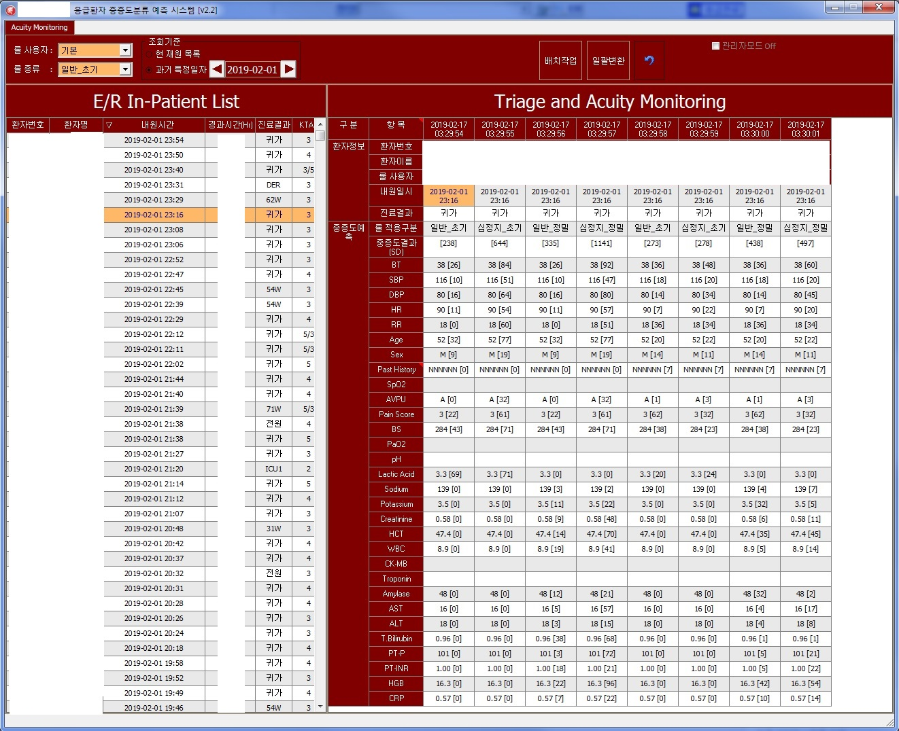

# er-triage-ml-features
this script contributs to extract "ER Triage" ml features from EHR 

## 오버뷰

## 배경
진료접근성이 좋고 수가가 상대적으로 저렴한 한국의 응급실은 늘 환자들로 북적이고 NEDIS와 KTAS와 같은 systemic tool이 있음에도 불구하고 ER환자에 대한 적정한 중증도 분류 및 진료에 대한 비용효과성 근거가 부족한 상황. 이런 문제를 풀기위해 다양한 연구자들은 er-triage-ml 모델링 연구중.

## 기술스택
python, pro*c

## 주요 features
`TBD`

